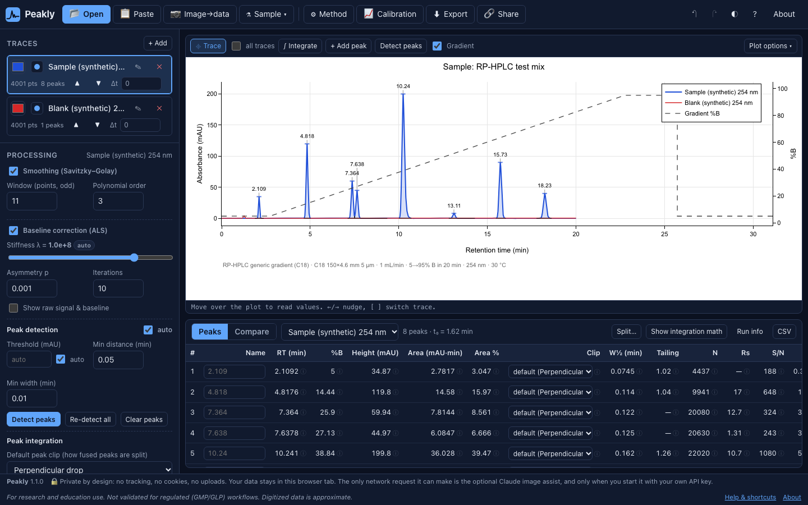
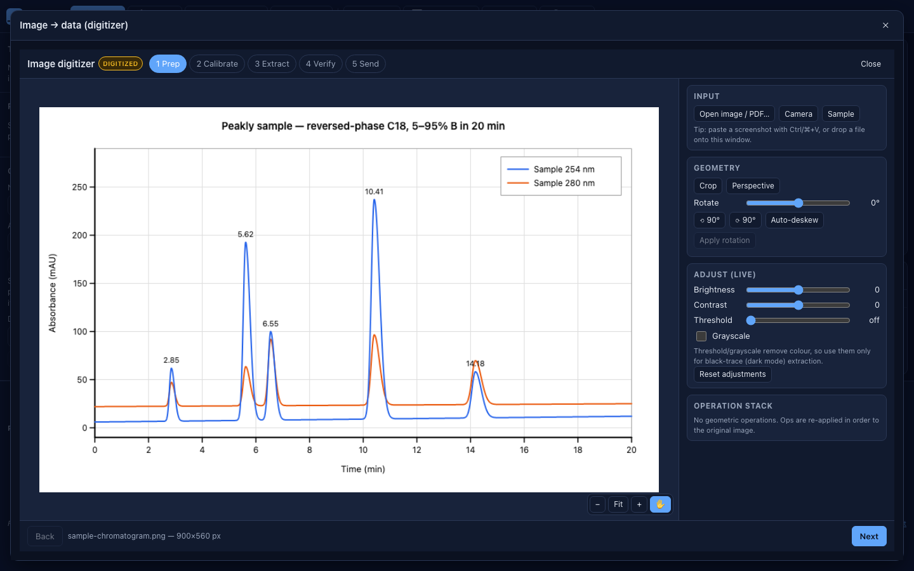
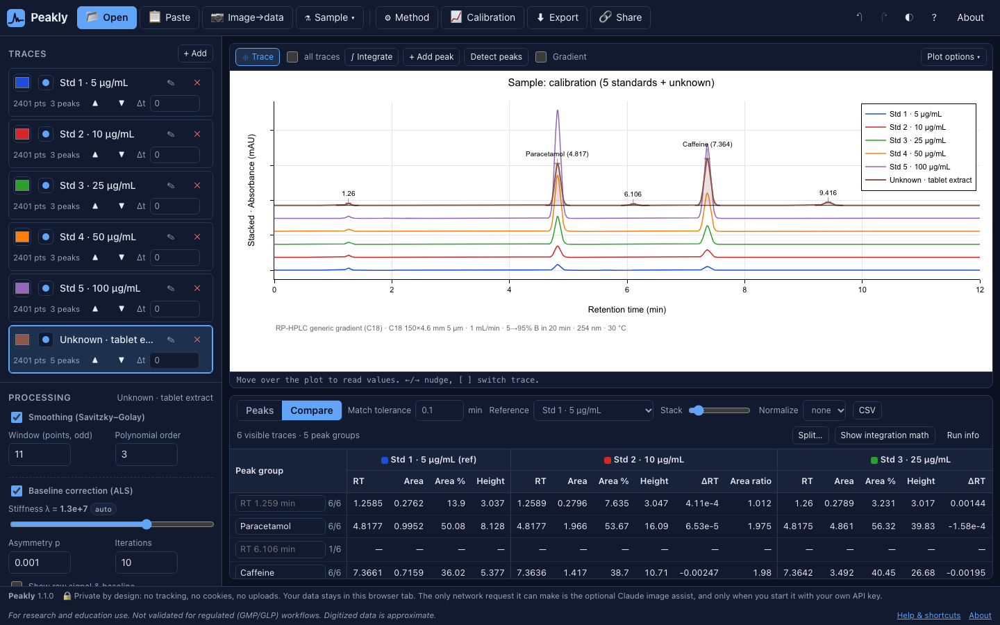
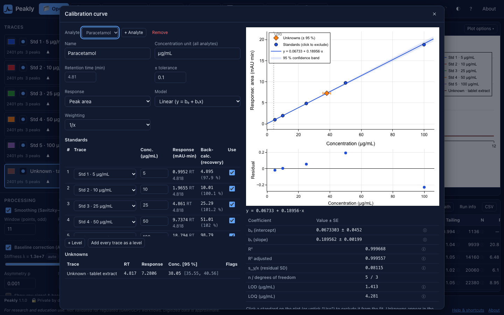
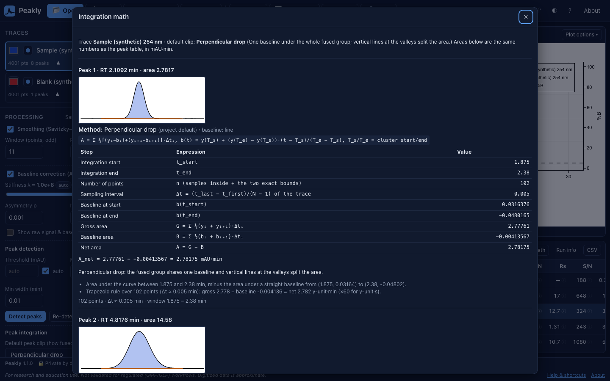
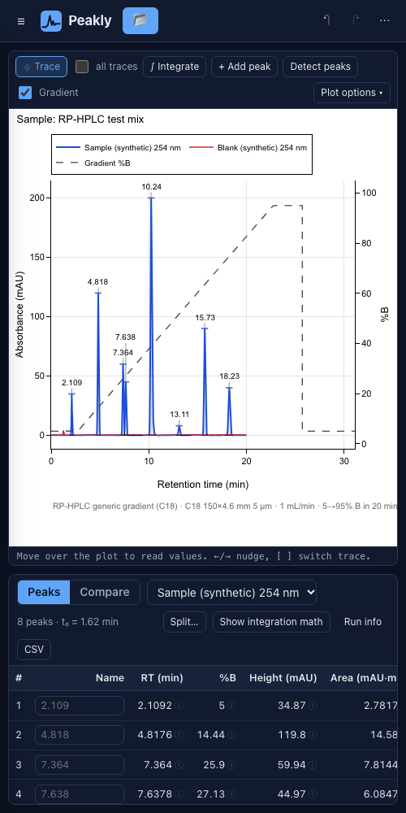

# Peakly

**Free, single-file, in-browser HPLC/FPLC chromatogram analysis.** Drop in a CSV, a vendor export, an Excel sheet, an Agilent `.ch` file, or even a *photo of a printed chromatogram*, and get retention times, integration, gradient context, calibration, overlays and a shareable report. Nothing is uploaded. Nothing is installed.

[](https://github.com/jschmitt1531/peakly/actions/workflows/test.yml)
[](LICENSE)
[](#how-to-cite)
<!-- After the first Zenodo release, replace the DOI badge with: [](https://doi.org/10.5281/zenodo.XXXXXXX) -->

**[Open Peakly in your browser](https://jschmitt1531.github.io/peakly/app/)** · [Download the single file](https://jschmitt1531.github.io/peakly/peakly.html) · [Documentation](https://jschmitt1531.github.io/peakly/) · [FAQ](docs/FAQ.md)

> For research and education use. Not validated for regulated (GMP/GLP) workflows. Digitized data is approximate.

| | |
|---|---|
|  |  |
|  |  |
|  |  |

## What it does

- **Reads your data where it is.** Generic CSV/TSV/Excel/JSON, open standards (JCAMP-DX, AnDI/netCDF, mzML), Agilent ChemStation `.ch` binaries and text exports from the common vendor packages (see [Supported formats](#supported-formats)).
- **Digitizes pictures.** Screenshots, PDF pages and phone photos of printed chromatograms become traces with explicit ± uncertainty, perspective correction for photos of screens or paper, and a check against the RT/area % values printed on the image.
- **Integrates transparently.** Automatic peak detection, click-to-integrate, six peak-clipping modes (drop, valley, baseline, tangent skim, exponential skim, curve-fit split) and an audit panel that shows every step of each area calculation.
- **Puts peaks in context.** Gradient program with dwell and void time, %B (or mM salt/imidazole) at elution, USP/Ph. Eur. system-suitability metrics (tailing, plates, resolution, S/N).
- **Quantifies.** Calibration curves (linear, through-origin, quadratic; 1/x and 1/x² weighting), inverse prediction with confidence intervals, LOD/LOQ, extrapolation flags.
- **Compares runs.** Overlays, normalization, alignment, difference traces, waterfall, cross-run peak matching with ΔRT and area ratios.
- **Shares without a server.** PNG/SVG figures, CSV/JSON tables, PDF report, project files, and share links that carry the compressed project in the URL fragment.

## 60-second quickstart

1. Open **[Peakly](https://jschmitt1531.github.io/peakly/app/)**, or download [`peakly.html`](https://jschmitt1531.github.io/peakly/peakly.html) and double-click it. Any current Chrome, Edge, Firefox or Safari works, including on a phone.
2. Click **Sample data** (an HPLC run, a blank and a gradient method) or **Sample image** (a printed chromatogram to digitize). Or drag your own file onto the window.
3. Hover the plot: the cursor follows the curve and shows time, signal and %B. Press **p** to detect peaks, or **g** and click a peak's start and end to integrate it by hand.
4. Click any area value's ⓘ to see exactly how it was calculated.
5. Name peaks in the table, fill in the method under **Method** (**m**), then **Export** (**e**) a PDF, CSV or project file, or **Share** (**s**) a link.

More: [tutorials](docs/tutorials/) for CSV files, vendor exports, binary files, FPLC/UNICORN, screenshots, phone photos, calibration curves, comparing runs, and integration/clipping.

## Supported formats

| Kind | Formats | Notes |
|---|---|---|
| Generic text | CSV / TSV / TXT (any delimiter, decimal comma, optional header), pasted numbers | Units detected from headers such as `Time (min)`, `sec`, `mAU` |
| Spreadsheets | Excel `.xlsx` / `.xls` | First numeric sheet; otherwise a column mapper opens |
| JSON | `[{x,y}]`, `[[x,y]]`, `{x:[],y:[]}`, `{traces:[…]}`, Peakly projects | See [docs/SCHEMA.md](docs/SCHEMA.md) |
| Python tool outputs | MOCCA2 JSON (`to_dict()`; one wavelength extracted), chromatoPy `FID_output.json` and `hplc_to_csv` CSV | Peaks and fitted areas come along ([interop](docs/SCHEMA.md#interoperability)) |
| Open standards | JCAMP-DX (AFFN and compressed ASDF), AnDI/netCDF-3 `.cdf`, mzML (TIC/BPC/UV, zlib) | netCDF-4/HDF5 and MS-Numpress are not supported |
| Vendor binary | Agilent ChemStation `.ch` (types 130/131, 179/181) | Read from public format descriptions |
| Vendor text exports | Agilent ChemStation/OpenLab CSV/TXT (incl. UTF-16), Thermo Chromeleon ASCII, Shimadzu LabSolutions ASCII, Waters Empower `.arw`, Cytiva UNICORN CSV/ASC, Bio-Rad ChromLab/NGC CSV | FPLC volume axes, %B and conductivity become their own traces |
| Images | PNG, JPG, WebP, GIF, BMP, PDF page, clipboard, phone camera | Digitized; carries ± uncertainty |

**How well tested is each format?** Every reader has automated tests, but so far they run only on **synthetic sample files** (in `samples/data/`) that were written from public format descriptions and documentation, not on exports from real instruments. Treat the vendor binary and vendor text readers (and the MOCCA2/chromatoPy importers) as **beta** until they have been checked against real files; the Agilent `.ch` type 181 compressed variant is the least certain. If a real file opens wrongly, please [send a format request](https://github.com/jschmitt1531/peakly/issues/new/choose) with a sample you're allowed to share.

**Not supported** (you get a clear message instead): Thermo `.raw`, Agilent `.uv` full spectra, Shimadzu `.lcd`, Waters raw folders, netCDF-4/HDF5. Export to text from the vendor software instead ([how](docs/tutorials/vendor-export.md)).

If a file isn't recognized, **"My format isn't working"** shows the raw text and lets you choose the delimiter, header row, x and y columns and units by hand. Want Peakly to read your instrument's files? [Open a format request](https://github.com/jschmitt1531/peakly/issues/new?template=format_request.yml) with a sample you are allowed to share, or [write a parser](CONTRIBUTING.md#adding-a-file-format).

## How the numbers are calculated

Every reported number has a documented formula, and the app shows the inputs behind each value.

- [docs/CALCULATIONS.md](docs/CALCULATIONS.md): smoothing, baseline, noise, peak detection, per-peak metrics (RT, area, FWHM, tailing, plates, resolution, S/N), gradient/dwell/void model, peak fitting.
- [docs/INTEGRATION.md](docs/INTEGRATION.md): integration bounds and the six peak-clipping modes, with worked examples.
- [docs/CALIBRATION.md](docs/CALIBRATION.md): calibration models, weighting, inverse prediction and its uncertainty, LOD/LOQ.
- [docs/VALIDATION.md](docs/VALIDATION.md): how the math is checked against reference values.
- [docs/DIGITIZER_ACCURACY.md](docs/DIGITIZER_ACCURACY.md): measured accuracy of image digitizing at different resolutions and compression levels.

## Known limits

**Regulated use.** Peakly is for research and education. It is **not** validated for GMP/GLP or other regulated workflows: there is no audit trail, electronic signature, access control or 21 CFR Part 11 / EU Annex 11 compliance. Use your validated chromatography data system for release testing.

**Digitized data is approximate.** A digitized trace is a reconstruction of a *picture*, not instrument data.
- **Good for:** retention times (to about ±½ pixel), peak order, relative heights, area % of resolved peaks, and comparing runs plotted the same way. On a clean 900 px wide plot, Peakly's benchmark finds RT errors ≤ 0.6 px and area-% errors ≤ 0.2 points ([details](docs/DIGITIZER_ACCURACY.md)).
- **Weak for:** absolute quantitation, small or overlapping peaks, noise and S/N, plate counts and tailing on narrow peaks, anything hidden behind a legend or label or clipped at the top of the plot, and log-scaled axes. Accuracy drops quickly below about 450 px plot width.
- Line thickness, anti-aliasing, JPEG compression and the printer or camera all distort the shape. Peakly labels every derived number with its ± uncertainty and never lets digitized data pass as raw data in exports.

**Other limits.**
- Single-wavelength traces only; DAD 3D (time × wavelength) data is not yet supported ([roadmap](ROADMAP.md)).
- Peak fitting finds a local optimum and assumes Gaussian or EMG shapes.
- Very large files (millions of points) are slow on phones.
- Share links do not include images, and long links may be truncated by some email clients; use a project file instead.

## Privacy

- **No backend, no accounts, no uploads, no analytics, no cookies** in the app. Your data stays in your browser tab.
- The only outbound requests are (1) loading the pinned libraries from public CDNs when the page opens and (2) the **optional** Claude vision assist in the digitizer, which runs only when you paste your own Anthropic API key and click the button. The key is held in memory for that tab and never saved.
- Share links put the compressed project in the URL `#fragment`, which browsers do not send to servers.
- The optional **feedback survey** is a Google Form that opens only when you click a survey link. It is anonymous unless you choose to leave an email address for future surveys.
- The project website (not the app) may use cookie-free, aggregate page-view counting if the maintainers enable it; it is off by default.

Full details: **[Privacy policy](docs/PRIVACY.md)** · [Terms of use](docs/TERMS.md) · [SECURITY.md](SECURITY.md) · [FAQ](docs/FAQ.md).

## Accessibility

Peakly aims for WCAG 2.1 Level AA and is currently **partially conformant**; known gaps and keyboard/data-entry alternatives are listed in the **[accessibility statement](docs/ACCESSIBILITY_STATEMENT.md)** (technical audit: [docs/ACCESSIBILITY.md](docs/ACCESSIBILITY.md)). Hit a barrier? [Report it](https://github.com/jschmitt1531/peakly/issues/new?template=accessibility.yml).

## How to cite

If Peakly helped your work, please cite it. GitHub's "Cite this repository" button reads [CITATION.cff](CITATION.cff).

> Schmitt, J. (2026). *Peakly: a free, single-file, in-browser HPLC/FPLC chromatogram analyzer* (Version 1.2.0) [Computer software]. https://github.com/jschmitt1531/peakly. DOI: pending.

A DOI will be minted by Zenodo with the first archived release ([docs/RELEASING.md](docs/RELEASING.md)). Please also mention the version you used and, for digitized data, that values were digitized from an image.

Using Peakly in teaching or a lab? [Tell us in Discussions](https://github.com/jschmitt1531/peakly/discussions); it helps justify maintainer time and funding. Labs can use the [letter-of-support template](docs/templates/letter-of-support.md) for grant applications.

## Contact

Questions, feedback, privacy or accessibility requests: **[peaklyfeedback@gmail.com](mailto:peaklyfeedback@gmail.com)** (project mailbox), [GitHub Discussions](https://github.com/jschmitt1531/peakly/discussions) or [issues](https://github.com/jschmitt1531/peakly/issues/new/choose). Security vulnerabilities: report privately as described in [SECURITY.md](SECURITY.md).

## Contributing

Contributions are welcome: bug reports, sample files, validation datasets, parsers, docs and translations.

- [CONTRIBUTING.md](CONTRIBUTING.md): dev setup (zero dependencies: `node tests/run.js`, `node build.js`), code style, licensing rules, and how to add a file format.
- [CODE_OF_CONDUCT.md](CODE_OF_CONDUCT.md) · [SECURITY.md](SECURITY.md) · [GOVERNANCE.md](GOVERNANCE.md) · [ROADMAP.md](ROADMAP.md) · [FUNDING.md](FUNDING.md) · [CHANGELOG.md](CHANGELOG.md)
- Policies: [Privacy](docs/PRIVACY.md) · [Terms of use](docs/TERMS.md) · [Accessibility statement](docs/ACCESSIBILITY_STATEMENT.md) · [Trademarks](docs/TRADEMARKS.md) · [Credits](docs/CREDITS.md)

```sh
node tests/run.js           # all tests (also runnable in the app: Help → Run self-tests)
node build.js               # inline src/ into index.html
node tools/validate.js      # numerical validation against reference values
node tools/digitizer-accuracy.js   # regenerate docs/DIGITIZER_ACCURACY.md
```

## About

Peakly is created and maintained by **[Jennifer Schmitt, Ph.D.](https://www.linkedin.com/in/jschmitt1531/)**, an analytical sciences leader with a Ph.D. in chemistry and an MBA from the Johns Hopkins Carey Business School. Jennifer Schmitt has spent a career turning chromatograms into decisions, from graduate research to biotech to analytical sciences leadership in the pharmaceutical industry, and is a long-time volunteer with the American Chemical Society Younger Chemists Committee.

Peakly exists because getting HPLC data out of vendor software should not require a license, a login, or a workaround.

**AI assistance.** Code written with the assistance of Claude (Anthropic); reviewed, tested and maintained by Jennifer Schmitt.

Peakly is an independent project. It is **not** affiliated with OpenChrom®, Lablicate, Eclipse ChemClipse, Anthropic, or any instrument vendor. Agilent, ChemStation, OpenLab, Waters, Empower, Thermo Scientific, Chromeleon, Shimadzu, LabSolutions, Bio-Rad, ChromLab, NGC, Cytiva, ÄKTA, UNICORN, OpenChrom, Claude, Google Forms, GitHub, Microsoft Excel and other names are trademarks of their respective owners, used only to describe compatibility ([details](docs/TRADEMARKS.md)).

## License

© 2026 Jennifer Schmitt. All rights reserved. Peakly is **free to use**, including at work, under the [Peakly Free-Use License](LICENSE). You may **not** copy, modify, merge, publish, distribute, sublicense or sell it without written permission (ask at peaklyfeedback@gmail.com). The source code is public so it can be reviewed, verified and cited. Your data and results are yours: the data you analyze never leaves your browser, and you may publish your figures, tables and reports freely. Runtime libraries are loaded from CDNs under their own licenses; see [THIRD_PARTY_NOTICES.md](THIRD_PARTY_NOTICES.md).

## Acknowledgements

Peakly's code is original. Prior work that shaped the design (no code copied; see [PRIOR_ART.md](PRIOR_ART.md)):

| Project | License | What we learned |
|---|---|---|
| OpenChrom / Eclipse ChemClipse | EPL-2.0 | Plugin-style importer architecture; detect → integrate → report pipeline |
| chromatoPy (G. Otiniano) | MIT | Multi-Gaussian fitting with area uncertainty; Peakly imports its output files |
| MOCCA2 (Bayer) | MIT | Interop target: Peakly imports MOCCA2's JSON serialization (format from its docs; no code used) |
| rainbow (E. Shi et al.) | LGPL-3.0 | Public prose documentation of the Agilent `.ch` binary layouts |
| chromConverter (E. Bass) | GPL-3.0 | Survey of common vendor export formats (code not used) |
| entab (R. Bovee) | MIT | Reference for Agilent/Thermo readers (not used, to keep a single file) |
| WebPlotDigitizer (A. Rohatgi) | AGPL-3.0 | The digitizing workflow concept: axis calibration and color-mask extraction |

Algorithms and references: Savitzky & Golay (1964); Eilers & Boelens (2005) asymmetric least squares; USP <621> and Ph. Eur. 2.2.46 system-suitability definitions; Levenberg (1944) and Marquardt (1963); Grushka (1972), Foley & Dorsey (1983) and Kalambet et al. (2011) for EMG; Dyson (*Chromatographic Integration Methods*, 2nd ed., 1998) for peak skimming; Hartley & Zisserman (*Multiple View Geometry*, 2nd ed., 2004) for homography; ICH Q2(R2), Miller & Miller (*Statistics and Chemometrics for Analytical Chemistry*) and the Eurachem *Fitness for Purpose* guide for calibration and LOD/LOQ.

Runtime libraries: Plotly.js (MIT), SheetJS Community Edition (Apache-2.0), pako (MIT AND Zlib), lz-string (MIT), jsPDF (MIT) and PDF.js (Apache-2.0); thank you to their maintainers. Project conventions: [Contributor Covenant 2.1](https://www.contributor-covenant.org/version/2/1/code_of_conduct/) (CC BY 4.0, adapted), [Keep a Changelog](https://keepachangelog.com/en/1.1.0/), [Semantic Versioning](https://semver.org/) (CC BY 3.0), [Citation File Format](https://citation-file-format.github.io/), badges by [Shields.io](https://shields.io/).

The complete list, with citations, licenses and data-format specifications, is in **[docs/CREDITS.md](docs/CREDITS.md)**.
