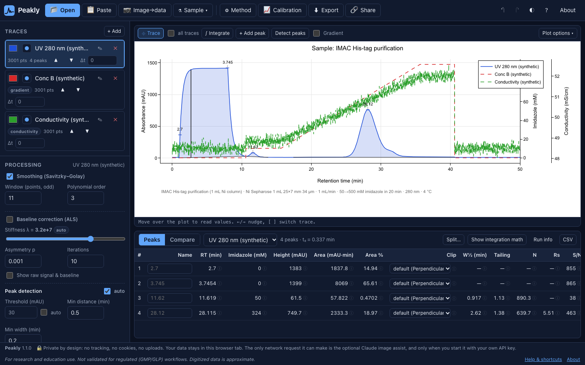

# Tutorial: FPLC runs and Cytiva UNICORN exports

**You need:** [`samples/data/unicorn.asc`](../../samples/data/unicorn.asc) (UNICORN export) or [`samples/data/biorad.csv`](../../samples/data/biorad.csv) (Bio-Rad NGC/ChromLab). **Time:** 5 minutes.

FPLC data differ from HPLC data in three ways Peakly handles explicitly: the x axis is usually **volume (mL)**, a run carries **several channels** (UV, conductivity, %B, pH, pressure), and there are **fraction marks**.

## 1. Export from UNICORN

In UNICORN's evaluation module, curves can typically be exported to a text/CSV/ASC file; select the UV curve(s) plus conductivity and concentration (%B) curves. Exact menu names differ between UNICORN versions. The export has paired columns per curve (`ml, mAU, ml, mS/cm, ml, %, …`).

## 2. Load it

1. Drag `unicorn.asc` into Peakly.
2. Each curve becomes a trace. UV traces are the main signals; conductivity (`mS/cm`) and %B (`%`) traces are marked as auxiliary and drawn on a second y axis.
3. The x axis stays in **mL** (the file has no time axis). A badge shows that x is volume.

## 3. Volume or time?

All peak calculations work on volume: retention volume, peak width in mL, area in mAU·mL. If you enter the **flow rate** in **Method**, you can convert to minutes. Keep volume when comparing runs at different flow rates.

## 4. Gradient context

For IMAC or ion-exchange, open **Method** (**m**):
1. Set the gradient type (**salt** or **imidazole**) and what 100 %B means (e.g. 500 mM imidazole, 1 M NaCl).
2. Enter the program (or let the %B trace from the file guide you).
3. The peak table then shows the **concentration at elution** (e.g. "elutes at 212 mM imidazole").

Try the built-in **FPLC / IMAC run** sample for a worked example.

## 5. Integrate and report

1. Press **p** to detect peaks on the UV trace, or **g** to integrate a window by hand (common for broad protein peaks).
2. Name the peaks (e.g. "flow-through", "target", "aggregate").
3. **Export → PDF report** includes the method, run info and auxiliary traces.

**Tips**
- Fractions in the export are shown as marks where supported, so you can see which tubes a peak spans.
- Conductivity is useful to check the actual gradient arriving at the detector (it includes system delay).
- Bio-Rad NGC/ChromLab CSVs load the same way; time or volume is taken from the file.
