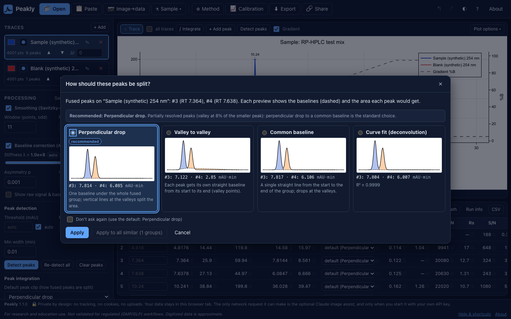

# Tutorial: integration and peak clipping

**You need:** the built-in **HPLC run + blank** sample (it has fused peaks around 5–7 min), or your own data. **Time:** 10 minutes.

Background and formulas: [INTEGRATION.md](../INTEGRATION.md) and [CALCULATIONS.md](../CALCULATIONS.md).

## 1. Automatic detection

1. Load the sample. Optionally turn on smoothing and baseline correction in the processing panel.
2. Press **p** (**Detect peaks**). Peaks are found by prominence above a threshold (**auto** = S/N 3), with minimum width and distance settings.
3. Manually set peaks are kept when you re-detect; **clear peaks** or "detect from scratch" discards them.

## 2. Manual integration

- **g** then click a peak's **start** and **end** on the curve: Peakly integrates exactly that window (straight baseline between your two points).
- **a** then click near an apex: adds a peak with automatically found bounds.
- Drag the bound handles to adjust; select a peak and press **Delete** to remove. Everything is undoable (Ctrl/⌘+Z).

## 3. Fused peaks: choose how to split them

When peaks share a boundary (no return to baseline between them), the way the area is split matters. Peakly offers six **clipping modes**; when detection creates fused peaks, the **"How should these peaks be split?"** dialog previews each mode with its baseline and resulting areas. You can also open it from a peak's ⓘ.

| Mode | Baseline | Typical use |
|---|---|---|
| **Drop** (default) | One baseline under the cluster; vertical lines at the valleys | Partially resolved peaks of similar size (the classic perpendicular drop) |
| **Valley** | Each peak's own straight line between its valley points | Peaks on a rising/falling baseline; what manual windows use |
| **Baseline** | One straight line from cluster start to end; drops at valleys | Cluster sitting on a sloped but straight baseline |
| **Tangent skim** | Straight tangent off the parent peak's tail | Small rider peak on the tail of a much larger peak |
| **Exponential skim** | Exponential fitted to the parent's tail | Rider on a strongly tailing parent |
| **Fit** | Gaussian/EMG components (deconvolution) | Strong overlap where any drop line is arbitrary |

**Skim rule of thumb (Dyson):** skim only when the parent is at least ~10× taller than the rider (`skimRatio`, default 10); otherwise use drop.

The project default for new automatic integrations is set in the processing panel (**clip default**); each peak can override it.

## 4. Audit the numbers

Click the ⓘ next to a peak's area: the **integration audit** shows the clipping mode, baseline points, number of samples, Δt, gross area, baseline area and net area, step by step, so you can reproduce the value by hand. Every other metric (tailing, plates, resolution, S/N) has the same kind of explanation.

## 5. Curve fitting

**Fit peaks** fits Gaussian or EMG components jointly over the selected peaks and reports each component's area with a standard error. Use it for strongly overlapped peaks, and compare with the drop/valley areas: large differences mean the split is uncertain whatever mode you report.

## 6. Report

The peak table CSV includes `clip`, `baseline_kind`, `baseline_area` and `gross_area` for every peak ([SCHEMA.md](../SCHEMA.md)), so others can see how each area was obtained.

**Tips**
- Be consistent: use the same mode for the same peak across runs you compare.
- Areas are in y-unit·min; multiply by 60 to compare with software that reports mAU·s.
